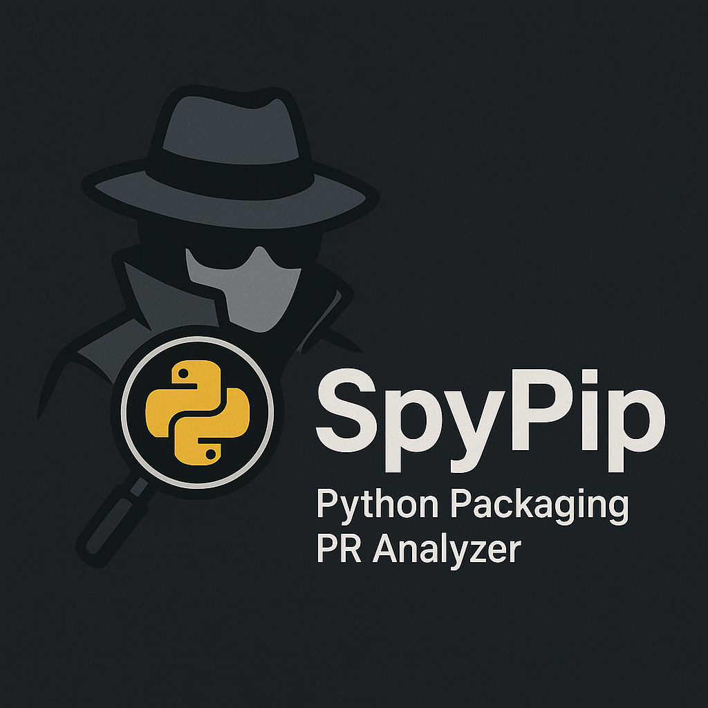
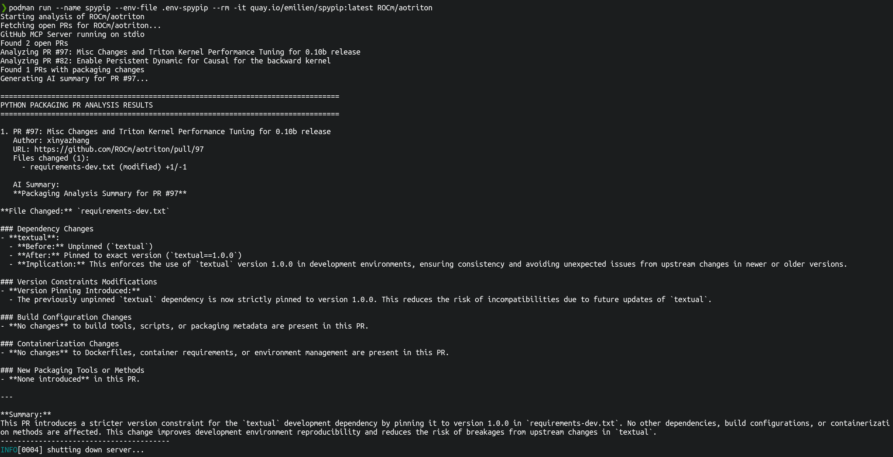

# SpyPip - Python Packaging PR Analyzer



SpyPip is a tool that analyzes GitHub repositories to find open pull requests that touch Python packaging files and provides AI-powered summaries of packaging-related changes.

## Features

- 🔍 **Smart Detection**: Automatically identifies PRs that modify packaging files (requirements.txt, pyproject.toml, setup.py, Dockerfiles, etc.)
- 🎯 **Custom File Monitoring**: Override default patterns by providing patch files with custom file paths to monitor
- 🤖 **AI Summaries**: Leverages LLM to generate concise summaries of packaging changes
- 📊 **Comprehensive Analysis**: Analyzes dependencies, build configurations, containerization changes, and version constraints
- 🔗 **GitHub Integration**: Seamlessly integrates with GitHub API via MCP (Model Context Protocol)
- 🧠 **Reasoning Model Support**: Compatible with reasoning models that include thinking steps in responses



## Quickstart

1. Create .env file:

```bash
# Copy the example file and edit it with your values
cp .env.example .env
# Edit .env with your favorite editor
vi .env
```

2. Run SpyPip

```bash
podman run --name spypip --env-file .env --rm -it quay.io/emilien/spypip:latest ROCm/aotriton
```

or

```bash
podman run --name spypip --env-file .env --rm -it \
  -v ./my-patches:/patches:ro,Z \
  quay.io/emilien/spypip:latest \
  ROCm/aotriton --patches-dir /patches
```

## Install and run locally

1. Clone the repository:
```bash
git clone https://github.com/EmilienM/spypip.git
cd spypip
```

2. Install dependencies:
```bash
pip install -e .
```

3. Set up environment variables:

**Option A: Using .env file (recommended)**
```bash
# Copy the example file and edit it with your values
cp .env.example .env
# Edit .env with your favorite editor
vi .env
```

**Option B: Using shell environment variables**
```bash
export OPENAI_API_KEY="your-openai-api-key"
export GITHUB_PERSONAL_ACCESS_TOKEN="your-github-token"
# Optional: Override the default OpenAI endpoint
export OPENAI_ENDPOINT_URL="https://your-custom-inference-server.com"
```

## Usage

Run SpyPip by specifying the repository you want to analyze:

```bash
python -m spypip owner/repository-name
```

For example:
```bash
python -m spypip vllm-project/vllm
```

### Custom File Monitoring with Patch Files

You can override the default list of packaging files by providing a directory containing patch files:

```bash
python -m spypip owner/repository-name --patches-dir /path/to/patches
```

The patches directory can contain:

**Git patch files (.patch, .diff):**
```bash
# example_patches/changes.patch
diff --git a/custom-requirements.txt b/custom-requirements.txt
index 1234567..abcdefg 100644
--- a/custom-requirements.txt
+++ b/custom-requirements.txt
@@ -1,3 +1,4 @@
 flask==2.0.0
 requests==2.28.0
+numpy==1.21.0
 pytest==7.1.0
```

**Plain text files (.txt) with file paths:**
```bash
# example_patches/file_list.txt
# Custom packaging files to monitor
project/requirements-dev.txt
deployment/Containerfile.prod
config/environment-staging.yml
build-constraints.txt
```

When using `--patches-dir`, SpyPip will:
1. Read all `.patch`, `.diff`, and `.txt` files in the specified directory
2. Extract exact file paths from git patches or plain text lists
3. Monitor PRs that touch exactly these file paths (no pattern matching)
4. Use exact path matching instead of the default packaging file patterns
5. Display a custom message showing which files are being monitored

## Output

SpyPip will:

1. Fetch all open pull requests from the specified repository
2. Identify PRs that modify packaging files
3. Generate AI-powered summaries for each relevant PR
4. Display a comprehensive report showing:
   - PR details (number, title, author, URL)
   - Changed packaging files with statistics
   - AI analysis of packaging implications

## Environment Variables

SpyPip supports loading environment variables from `.env` files. It searches for `.env` files in the following order:
1. Current working directory
2. User's home directory
3. Project root directory

**Required Variables:**
- `OPENAI_API_KEY`: Required for AI summary generation
- `GITHUB_PERSONAL_ACCESS_TOKEN`: Required for GitHub API access

**Optional Variables:**
- `OPENAI_ENDPOINT_URL`: Override the default OpenAI inference server URL (defaults to `https://models.github.ai/inference`)
- `MODEL_NAME`: Specify the model to use for AI analysis (defaults to `openai/gpt-4.1`)

**Note:** Environment variables set in your shell will take precedence over those in `.env` files.

## Contributing

Contributions are welcome! Please feel free to submit pull requests or open issues for bugs and feature requests.
